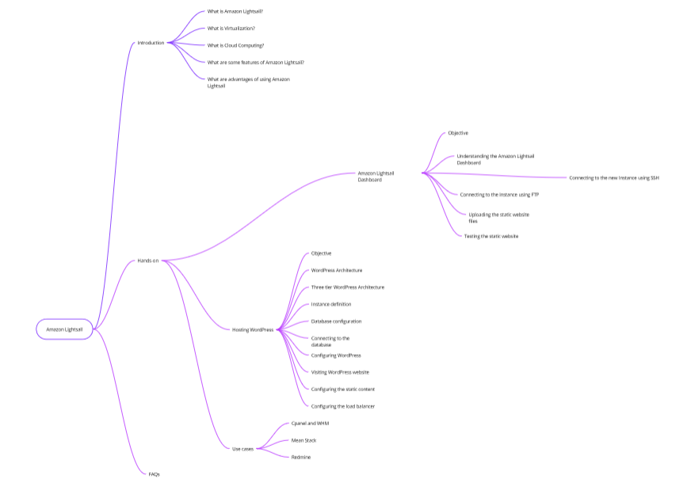

# Amazon Lightsail

A quick and crisp tutorial on Amazon Lightsail

## What is Amazon Lightsail?

Amazon Lightsail is a managed service that makes it easy to create, manage, and use web servers in the cloud. 

As per AWS website

> Amazon Lightsail provides easy-to-use cloud resources to get your web application or websites up and running in just a few clicks. Lightsail offers simplified services such as instances, containers, databases, storage, and more. With Lightsail, you can easily spin up websites or applications using pre-configured blueprints like WordPress, Prestashop, or LAMP. You can use Lightsail features to simply host static content, connect your content to an audience around the globe, or get your Windows Business server up and running. The Lightsail console guides you through the configuration process, and in many cases, has components already configured.


## Terminology explained

| S.No. | Lightsail| VPS |
| --- | --- | --- |
| 1 | Instances | Virtual Private Server |
| 2 | Simplified load balancers | Load balancer |
| 3 | Containers | Docker Container |
| 4 | Managed Databases | Database |
| 5 | Block and object storage | Object storage |


## Learning MindMap



## SCP files to the remote server

To secure copy files to the remote server you can use the following command


```scp -i ~/Documents/aws/ssh_keys/websiteSydneyLightsail.pem * ubuntu@3.27.59.201:/var/www/html/```
